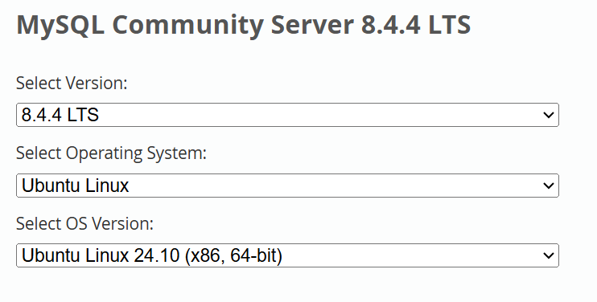
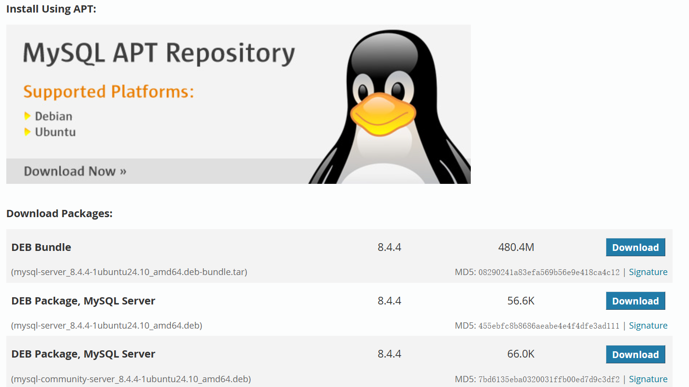
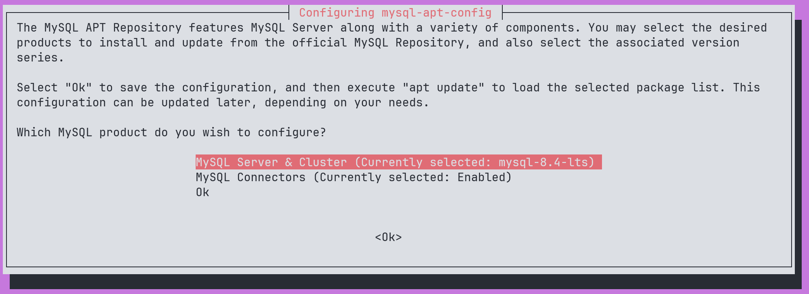

进入[MySQL 官网](https://dev.mysql.com/downloads/mysql/)下载页选择对应 MySQL 版本

推荐选择LTS版本



下方选择安装方式

- APT在线
- 安装包离线



## APT

下载文件[https://dev.mysql.com/downloads/repo/apt/](https://dev.mysql.com/downloads/repo/apt/)

将文件上传到服务器运行命令选择版本 **默认即可**

例如文件`mysql-apt-config_0.8.33-1_all.deb`

```bash
sudo dpkg -i mysql-apt-config_0.8.33-1_all.deb
```



更新包`sudo apt update`

### 更新主要发布版本

默认情况下，MySQL 服务器和其他组件的安装和升级都来自配置包安装期间选择的主要版本系列。但您可以通过重新配置已安装的配置包随时切换到另一个受支持的主要发布系列。使用以下命令：

```ba
sudo dpkg-reconfigure mysql-apt-config
```

在弹出的对话框中选择所需的主要发布版本，然后点击“Ok”。返回命令行后，使用以下命令更新 MySQL APT 存储库的包信息：

```bash
sudo apt update
```

覆盖原始文件后再次更新`sudo apt update`

### 使用 APT 安装 MySQL

使用以下命令安装 MySQL：

```bash
sudo apt install mysql-server
```

在安装过程中，系统会提示您为 MySQL 安装设置 root 用户密码。

### 启动和停止 MySQL 服务器

MySQL 服务器在安装后会自动启动。您可以使用以下命令检查 MySQL 服务器的状态：

```bash
sudo systemctl status mysql
```

## 软件包下载

下载完整 tarball 后，上传到服务器

解压`tar -xf mysql-server_*MVER*-*DVER*_*CPU*.deb-bundle.tar`

```bash
# 此依赖为ubuntu 24版本，不同版本名称不一致
sudo apt install libaio-dev libaio1t64 libnuma1 libmecab2
sudo dpkg-preconfigure mysql-community-server_*.deb
sudo dpkg -i mysql-{common,community-client-plugins,community-client-core,\
community-client,client,community-server-core,community-server,server}_*.deb
```

报错请输入`sudo apt -f install`下载依赖项

## 配置普通用户远程登录

```sql
CREATE DATABASE test;
CREATE USER 'test'@'%' IDENTIFIED BY 'test';
GRANT ALL PRIVILEGES ON test.* TO 'test'@'%';
FLUSH PRIVILEGES;
```