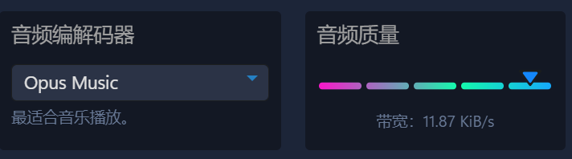

## Linux系统安装教程

相关链接

> [安装docker](/note/#250120--linux-部署-docker)

:::tip
关于带宽占用。最高音质占用11.87KB/s

1MB 带宽理论可以供( 1024**Kb** / 8**b** ) / 11.87**KB** = **10.78**人


:::

### 使用docker部署

默认端口

| 端口      | 功能       |
| ------   | --------   |
| 9987/UDP | 语言端口    |
| 30033    | 文件端口    |
| 10011    | 管理员端口  |

```bash
docker run -d -e TS3SERVER_LICENSE=accept --net=host --name=ts1 teamspeak
```

:::tip
命令解释 \
`-d` 后台运行容器 \
`-e TS3SERVER_LICENSE=accept`同意许可 \
`--net=host --name=ts1` 使用物理机网络，命名容器

需要放行`9987/udp` `30033/tcp` `10011/tcp` 端口
:::


#### 配置变量，修改端口配置

修改语言端口 [ 服务器带宽足够即可**多开** ]

```bash
docker run -e TS3SERVER_LICENSE=accept \
-p 9988:9987/udp \
--name ts-9988 teamspeak

docker run -e TS3SERVER_LICENSE=accept \
-p 9989:9987/udp \
--name ts-9989 teamspeak
```

:::tip
命令解释\
使用`-p`将容器端口转发到物理机实现修改端口 \
不转发`30033文件端口`和`10011管理员端口` \
无法上传文件和管理服务器 \
使用`--name`指定容器名称
:::


文件端口-默认开放。可不开防火墙或不转发端口以减少文件上传下载流量占用

文件传输**IP地址**和**PORT端口**绑定使用，IP全部ipv4地址即可

```bash
docker run -e TS3SERVER_LICENSE=accept \
-e TS3SERVER_FILETRANSFER_PORT=50033 \
-e TS3SERVER_FILETRANSFER_IP=0.0.0.0 \
-p 9990:9987/udp -p 50033:50033 \
--name ts-9990 teamspeak
```

:::tip
命令解释\
使用`-e TS3SERVER_FILETRANSFER_PORT=50033`修改文件端口 \
使用`-e TS3SERVER_FILETRANSFER_IP=50033`修改文件IP \
不转发`10011管理员端口` \
无法管理服务器 \
使用`--name`指定容器名称
:::

### 使用docker compose进阶配置

创建文件夹后再往里创建文件docker-compose.yml

```bash
cd
mkdir teamspeak && touch teamspeak/docker-compose.yml
cd teamspeak
```

配置数据库并将数据挂载到本地

```yaml
services:
  teamspeak: 
    image: teamspeak
    container_name: ts3server
    restart: always
    # 默认转发
    ports:
     - 9987:9987/udp
     - 10011:10011
     - 30033:30033
    environment: 
    # 使用其他数据库
      TS3SERVER_DB_PLUGIN: ts3db_mariadb
      TS3SERVER_DB_SQLCREATEPATH: create_mariadb
      TS3SERVER_DB_HOST: db
      TS3SERVER_DB_USER: root
      # 设置数据库密码
      TS3SERVER_DB_PASSWORD: example
      TS3SERVER_DB_NAME: teamspeak
      TS3SERVER_DB_WAITUNTILREADY: 30
      TS3SERVER_LICENSE: accept
    volumes: 
     - ./data/server:/var/ts3server
  db:
    image: mariadb
    container_name: ts3db
    restart: always
    environment: 
    # 设置数据库密码
      MYSQL_ROOT_PASSWORD: example
      MYSQL_DATABASE: teamspeak
    volumes: 
     - ./data/db/:/var/lib/mysql
```

ts3db.ini数据库自定义配置

```ini
[config]
host='${TS3SERVER_DB_HOST}'
port='${TS3SERVER_DB_PORT:-3306}'
username='${TS3SERVER_DB_USER}'
password='${TS3SERVER_DB_PASSWORD}'
database='${TS3SERVER_DB_NAME}'
socket=
wait_until_ready='${TS3SERVER_DB_WAITUNTILREADY:-30}
```

更多配置可以查看[docker](https://hub.docker.com/_/teamspeak)  [github](https://github.com/TeamSpeak-Systems/teamspeak-linux-docker-images/blob/master/alpine/entrypoint.sh)
